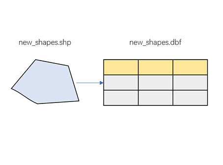
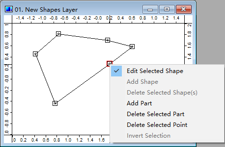

# 3.2 Vector Shapes
MicroCity can open, create and edit ArcGIS shapefiles (\*.shp) which are called **Shapes** and maintained in the **Data** Tab of the **Workspace** Panel. By using **modules** (see [3.7](3.7_modules.md)) other vector file formats, such like Scalable Vector Graphics (\*.svg) and AutoCAD Drawing Exchange Format (\*.dxf), can also be imported or exported.
## Opening, Creating, Saving and Closing Shapes
Users can click **Load** button  or **File->Shapes->Load** menu item to open an ArcGIS shapefile (\*.shp) as a **Shapes**. Creating a new **Shapes** can be done from menu **File->Shapes->New** and the pop-up dialog as shown below. The relationship between a ArcGIS shapefile (\*.shp) and a same named dBase file (\*.dbf) is also shown.

 &nbsp;&nbsp; 

Saving a **Shapes** can be done from the right click context menu **Save or Save As**. You can also close a **Shapes** from the menu and get a prompt dialog to save it.

 &nbsp;&nbsp; 

## Showing and Editing Shapes
Double click a **Shapes** from the **Data** Tab will give you a map view (for maps and layers see [3.6](3.6_maps_and_layers.md)). Toggle **Action** botton  and right click a **Shape** in a **Shapes** layer and choose **Edit Selected Shape** then go to the **Editing Mode**. In this mode users can add/delete parts and add/delete points in a shape (for data structure of a shape see [2.2](2.2_searching_for_countries.md)). The associated attributes table (\*.dbf) of a **Shapes** can be accessed through right-clicking context menu **Attributes->Table->Show** (see the tutorial [2.1](2.1_showing_a_world_map.md)). 

 &nbsp;&nbsp; 

## Display Settings and Data Visualization
Users can change **Shapes** outline, fill, labels and other display settins from the **Settings** Panel. Some options can connect attribute data and give visualization functionalities (for example [2.1](2.1_showing_a_world_map.md)).

[**< 3.1 UI Overview**](3.1_ui_overview.md) | [**Table of Contents**](.) | [**3.3 Raster Grids >**](3.3_raster_grids.md)
