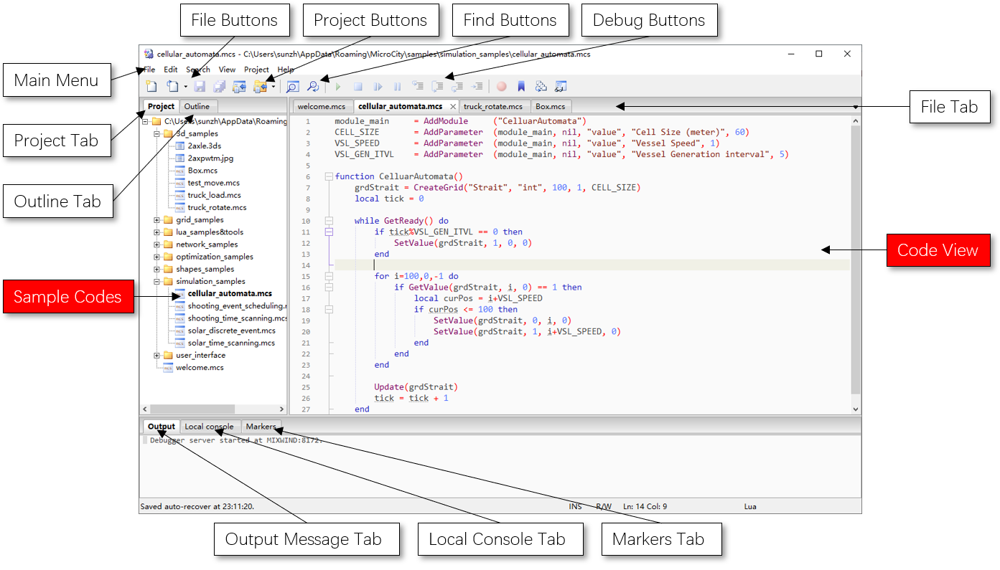

# 4.1 Scripting Interfaces Overview
MicroCity uses **Modules** (see [3.7](3.7_modules.md)) to extend its functionalities. One type of the modules is **MicroCity Script** (\*.mcs) which can be edited and debugged in the **Script Editor**.
## The Script Editor  

## Coding and Debugging MicroCity Scripts
**ScriptEditor** is based on [ZeroBrane](https://studio.zerobrane.com/). One can find detailed information there. For debugging, you should keep **Script Editor** being opened. Then right click the **module** from **MicroCity** and choose **Debug** item in the context menu (see [3.7](3.7_modules.md#loading-closing-and-executing-modules)). The execution can be indicated in the **Code View** of **ScriptEditor**. You can control the execution and watch variables with **Debug Buttons**.
## The Lua Language and Embedded Functions
MicroCity uses [Lua 5.1](https://www.lua.org/manual/5.1/) as its script language. One can find the reference manual there. MicroCity embeds many useful funtions in Lua, which can not only control user interfaces, manipulate data, but also can solve mathematical models and sun simulations. You should read following chapters for more information.  

**Conventions in This Reference:**  
Following is an example of a embedded function description.
```lua
AddParameter (module, parent_node, "value",  "description" [, default = 0])
```
To clarify the parameter type in a embedded function, we use name and quotation mark to avoid ambiguities. In this case, the *module* parameter is an object, the *"value"* parameter is a string, and the *default* parameter is a number. 

[**< 3.7 Modules**](3.7_modules.md) | [**Table of Contents**](.) | [**4.2 UI Control >**](4.2_ui_control.md)
